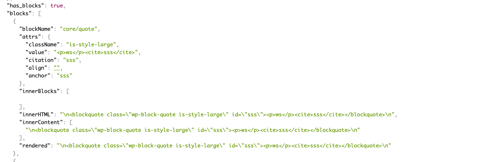

# REST API blocks
Contributors: spacedmonkey
Donate link: https://github.com/sponsors/spacedmonkey
Tags: blocks, gutenberg, api, wp-json, rest-api
Requires at least: 5.5
Tested up to: 6.5
Requires PHP: 7.0.0
Stable tag: 1.0.2
License: GPLv3 or later
License URI: https://www.gnu.org/licenses/gpl-3.0.en.html



Add gutenberg blocks data into the post / page REST API endpoints.

[](https://travis-ci.com/spacedmonkey/wp-rest-blocks)

## Description

A simple plugin to add block data in json format into the rest api. Once installed, there will be two new fields added to the rest api, `has_blocks` and `blocks`.
For example output.
```
"has_blocks": true,
"block_data": [
  {
	"blockName": "core/image",
	"attrs": {
	  "url": "https://www.spacedmonkey.com/wp-content/uploads/2018/12/test-image.jpg",
	  "alt": "Terminal de aeropuerto",
	  "caption": "fsfsdfdsfdssfd",
	  "href": "https://www.spacedmonkey.com/test-image",
	  "rel": "noreferrer noopener",
	  "linkClass": "jonny-123",
	  "linkTarget": "_blank",
	  "id": 147355,
	  "width": 582,
	  "height": 327,
	  "linkDestination": "attachment"
	},
	"innerBlocks": [
	],
	"innerHTML": "\n<figure class=\"wp-block-image is-resized\"><a class=\"jonny-123\" href=\"https://www.spacedmonkey.com/test-image\" target=\"_blank\" rel=\"noreferrer noopener\"></a><figcaption>fsfsdfdsfdssfd</figcaption></figure>\n",
	"innerContent": [
	  "\n<figure class=\"wp-block-image is-resized\"><a class=\"jonny-123\" href=\"https://www.spacedmonkey.com/test-image\" target=\"_blank\" rel=\"noreferrer noopener\"></a><figcaption>fsfsdfdsfdssfd</figcaption></figure>\n"
	],
	"rendered": "\n<figure class=\"wp-block-image is-resized\"><a class=\"jonny-123\" href=\"https://www.spacedmonkey.com/test-image\" target=\"_blank\" rel=\"noreferrer noopener\"></a><figcaption>fsfsdfdsfdssfd</figcaption></figure>\n"
  }
],
```

### Technical Notes

* Requires PHP 5.6+.
* Requires WordPress 5.5+.
* Issues and Pull requests welcome on the GitHub repository: https://github.com/spacedmonkey/wp-rest-blocks

## Installation

### Using The WordPress Dashboard

1. Navigate to the 'Add New' in the plugins dashboard
2. Search for 'wp-rest-blocks'
3. Click 'Install Now'
4. Activate the plugin on the Plugin dashboard

### Uploading in WordPress Dashboard

1. Navigate to the 'Add New' in the plugins dashboard
2. Navigate to the 'Upload' area
3. Select `wp-rest-blocks.zip` from your computer
4. Click 'Install Now'
5. Activate the plugin in the Plugin dashboard

### Using FTP
1. Download `wp-rest-blocks.zip`
2. Extract the `wp-rest-blocks` directory to your computer
3. Upload the `wp-rest-blocks` directory to the `/wp-content/plugins/` directory
4. Activate the plugin in the Plugin dashboard

## Screenshots

1. Add fields to the rest api.

## Changelog ##

### 1.0.2 ###
* Fix issue with WordPress 6.5
* Update coding standards to WP coding standards 3.1.0
* Mark tested up to WP 6.5

### 1.0.1 ###
* Update coding standards to WP coding standards 3.0.1
* Mark tested up to WP 6.4

### 1.0.0 ###
Breaking change!
The field in the REST API is changed from `blocks` to `block_data`.

### 0.5.0 ###
* Add support for new post types added in WordPress 5.9.

### 0.4.0 ###
* Added support for block based widget, added in WordPress 5.8. Block data is added to the /wp/v2/widgets endpoint.

### 0.3.2 ###
* Update translations

### 0.3.1 ###
* Hot fix.

### 0.3.0 ###
* Improve support for block that have attributes that use query source type.
* Improve error handling for those that install this plugin without using composer.

### 0.2.1 ###
* Update dependency.

### 0.2.0 ###
* Breaking change. Field names have changed and required WordPress 5.5+

### 0.1.0 ###
* First version.
